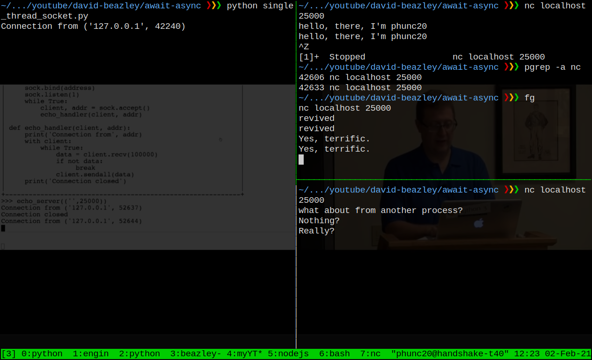
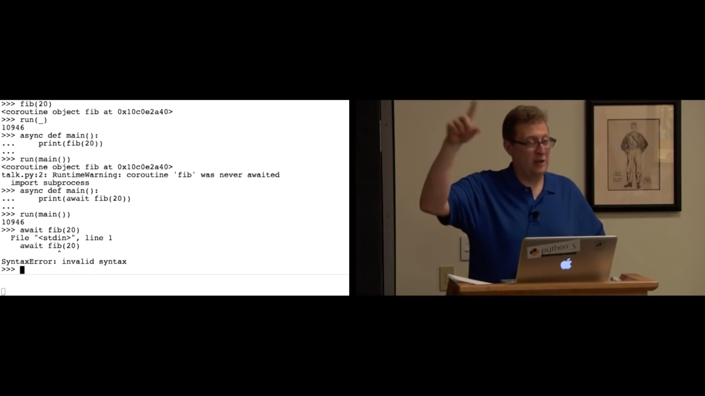
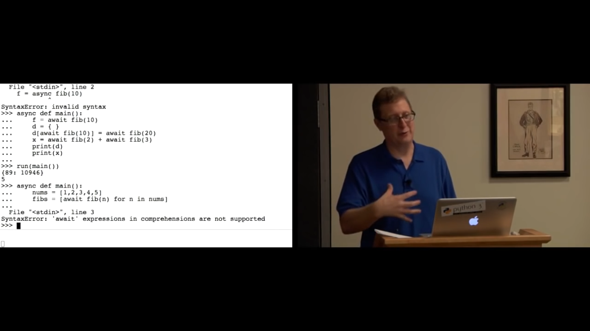

## Which video?
- [https://www.youtube.com/watch?v=E-1Y4kSsAFc&t=178s](https://www.youtube.com/watch?v=E-1Y4kSsAFc&t=178s)

## About the title
- [Fear and Loathing in Las Vegas](https://www.imdb.com/title/tt0120669/)


## Non-default packages
- In order to `from twisted.internet import reactor, protocol` just install by `pip install twisted`

## Video structure
- **`00:00:00`**: start by talking about socket programming, an application/motivation
- **`00:11:00`**: start talking about **async**, no socket any more


## The first example on single-threaded socket
In my first commit of the current repo, I made a **mistake/bug**
> I shouldn't have named the python script `socket.py`. Because it contains the line **`import socket`**, the Python interpreter will get confused of which `socket` it should use. Rename it to anything other than `socket.py` resolves the bug.

Here is a sample screenshot done on my laptop. Note that, unlike Mr. Beazley's live session video, my second
instance of `nc` did not get responded after the first one being stopped.
<br>
<br>


## Why Turning to Async?
Having async to deal with, say 20,000 sockets, is more efficient than creating 20,000 threads.


## Keywords
- callback
- asynchronous
- coroutine: synomymous with async function
- asynchronous context manager: `async def some_fn()` and `await`. This is essentially modern Python code using coroutines

## `00:11:00 - 00:16:57`, `StopIteration`
```python
In [4]: async def greeting(name):
   ...:     return "Hello " + name
   ...:

In [5]: def greet(name):
   ...:     return "Hello " + name
   ...:

In [6]: greet("Beazley")
Out[6]: 'Hello Beazley'

In [7]: greeting("Beazley")
Out[7]: <coroutine object greeting at 0x7fa84ab8ee40>

In [8]: g = greeting("Beazley")

In [8]: g.send(0)
---------------------------------------------------------------------------
TypeError                                 Traceback (most recent call last)
<ipython-input-4-7fe79daa96e7> in <module>
----> 1 g.send(0)

TypeError: can't send non-None value to a just-started coroutine

In [9]: g.send(None)
---------------------------------------------------------------------------
StopIteration                             Traceback (most recent call last)
<ipython-input-9-70a3cd01dee6> in <module>
----> 1 g.send(None)

StopIteration: Hello Beazley

In [10]: def run(coro):
    ...:     try:
    ...:         coro.send(None)
    ...:     except StopIteration as e:
    ...:         return e.value
    ...:

In [11]: run(g)
---------------------------------------------------------------------------
RuntimeError                              Traceback (most recent call last)
<ipython-input-11-0eed3bf36c9f> in <module>
----> 1 run(g)

<ipython-input-10-5d780f90dd1e> in run(coro)
      1 def run(coro):
      2     try:
----> 3         coro.send(None)
      4     except StopIteration as e:
      5         return e.value

RuntimeError: cannot reuse already awaited coroutine

In [11]: g = greeting("Beazley")

In [11]: run(g)
Out[11]: 'Hello Beazley'

In [12]: run(greeting("Huy"))
Out[12]: 'Hello Huy'

In [13]: run(greeting("Pike"))
Out[13]: 'Hello Pike'

In [14]: help(g.send)
send(...) method of builtins.coroutine instance
    send(arg) -> send 'arg' into coroutine,
    return next iterated value or raise StopIteration.
```

## On stage: `await`
- Had we not have used `await`
- Had we used `await`
  ```python
  In [14]: async def main():
      ...:     print(await greeting("Guido"))
      ...:
  
  In [15]: run(main)
  ---------------------------------------------------------------------------
  AttributeError                            Traceback (most recent call last)
  <ipython-input-15-8f22bbbd4c21> in <module>
  ----> 1 run(main)
  
  <ipython-input-10-5d780f90dd1e> in run(coro)
        1 def run(coro):
        2     try:
  ----> 3         coro.send(None)
        4     except StopIteration as e:
        5         return e.value
  
  AttributeError: 'function' object has no attribute 'send'
  
  In [16]: run(main())
  Hello Guido
  
  In [17]: type(main)
  Out[17]: function
  
  In [18]: type(main())
  <ipython-input-18-93d3160360ae>:1: RuntimeWarning: coroutine 'main' was never awaited
    type(main())
  RuntimeWarning: Enable tracemalloc to get the object allocation traceback
  Out[18]: coroutine
  
  In [18]: async def main():
      ...:     print(greeting("Guido"))
      ...:
  
  In [18]: run(main())
  <coroutine object greeting at 0x7ff34bcf5a70>
  /home/phunc20/.virtualenvs/tf2.3.0-torch1.6.0-py3.7/bin/ipython:2: RuntimeWarning: coroutine 'greeting' was never awaited
    # -*- coding: utf-8 -*-
  RuntimeWarning: Enable tracemalloc to get the object allocation traceback
  
  In [19]: type(greeting)
  Out[19]: function
  
  In [20]: type(greeting())
  ---------------------------------------------------------------------------
  TypeError                                 Traceback (most recent call last)
  <ipython-input-20-27cdcc517f0c> in <module>
  ----> 1 type(greeting())
  
  TypeError: greeting() missing 1 required positional argument: 'name'
  
  In [21]: type(greeting("Lamy"))
  <ipython-input-21-4d7aedb0e171>:1: RuntimeWarning: coroutine 'greeting' was never awaited
    type(greeting("Lamy"))
  RuntimeWarning: Enable tracemalloc to get the object allocation traceback
  Out[21]: coroutine
  
  In [22]: async def main():
      ...:     names = ["Alice", "Bob", "Carl"]
      ...:     for n in names:
      ...:         print(await greeting(n))
      ...:
  
  In [23]: run(main())
  Hello Alice
  Hello Bob
  Hello Carl
  
  ```

## `00:16:57 - ?`, recursive fibonacci numbers with `async`
```python
async def fib(n):
    if n < 2:
        return 1
    else:
        return await fib(n-1) + await fib(n-2)

async def main():
    for n in range(30):
        print(await fib(n))

```
Once run, this gives

```ipython
In [12]: async def fib(n):
    ...:     if n < 2:
    ...:         return 1
    ...:     else:
    ...:         return await fib(n-1) + await fib(n-2)
    ...:
    ...: async def main():
    ...:     for n in range(30):
    ...:         print(await fib(n))
    ...:

In [13]: run(main())
1
1
2
3
5
8
13
21
34
55
89
144
233
377
610
987
1597
2584
4181
6765
10946
17711
28657
46368
75025
121393
196418
317811
514229
832040

In [14]: fib(30)
Out[14]: <coroutine object fib at 0x7f2462b29200>

In [15]: run(_)
Out[15]: 1346269

In [16]: async def main():
   ...:     print(fib(20))
   ...:

In [17]: run(main())
<coroutine object fib at 0x7f2462b325f0>
/home/phunc20/.virtualenvs/tf2.3.0-torch1.6.0-py3.7/bin/ipython:2: RuntimeWarning: coroutine 'fib' was never awaited
  # -*- coding: utf-8 -*-
RuntimeWarning: Enable tracemalloc to get the object allocation traceback

In [18]: async def main():
   ...:     print(await fib(20))
   ...:

In [19]: run(main())
10946

In [20]: async def main():
    ...:     print("1st message")
    ...:     print(f"fib(5) = {await fib(5)}")
    ...:     return "main's return"
    ...:     print(await fib(7))
    ...:

In [21]: run(main())
1st message
fib(5) = 8
Out[21]: "main's return"

In [22]: def tweaked_run(coro):
    ...:     try:
    ...:         coro.send(None)
    ...:         print("Touched")
    ...:     except StopIteration as e:
    ...:         return e.value
    ...:

In [23]: tweaked_run(main())
1st message
fib(5) = 8
Out[23]: "main's return"

In [24]: def tweaked_run(coro):
    ...:     try:
    ...:         coro.send(None)
    ...:     except StopIteration as e:
    ...:         print("Chặm tới")
    ...:         return e.value
    ...:

In [25]: tweaked_run(main())
1st message
fib(5) = 8
Chặm tới
Out[25]: "main's return"

In [26]: async def main():
    ...:     for n in range(30):
    ...:         print(await fib(n))
    ...:     return "Dumb return value"
    ...:

In [27]: tweaked_run(main())
1
1
2
3
5
8
13
21
34
55
89
144
233
377
610
987
1597
2584
4181
6765
10946
17711
28657
46368
75025
121393
196418
317811
514229
832040
Touched
Out[27]: 'Dumb return value'
```
So, `run(main())` will run thru every single line of the coroutine `main()` without encountering any error (if the code was well written), except at the last line where a `StopIteration` will be triggered.


## Unlike in the video (i.e. unlike back in year 2016)
In year 2020, with Python3.7,

#### 01. we can `await` in REPL.
```
In [8]: await fib(10)
Out[8]: 89
```

#### 02. List comprehension is also allowed.
```python
async def main():
    nums = [1,2,3,4,5]
    fibs = [await fib(n) for n in nums]
    return fibs
```
```
In [33]: async def main():
    ...:     nums = [1,2,3,4,5]
    ...:     fibs = [await fib(n) for n in nums]
    ...:     return fibs
    ...:

In [34]: tweaked_run(main())
Touched
Out[34]: [1, 2, 3, 5, 8]
```


## Where does One Put The `await` Keyword?
- Not in a normal function
  ```
  In [29]: def spam():
      ...:     print(await fib(5))
    File "<ipython-input-29-22d735227a81>", line 5
  SyntaxError: 'await' outside async function
  ```
  - otherwise, in an async function, it's pretty much free as to where one can put `await`, e.g.
  ```python
  async def main():
      f = await fib(10)
      d = {}
      d[await fib(10)] = await fib(20)
      x = await fib(7) + await fib(9)
      print(d)
      print(x)
  ```
  ```
  In [32]: run(main())
  {89: 10946}
  76
  ```
- Not inside a `lambda` function
  ```
  In [36]: lambda x: await fib(x)
    File "<ipython-input-36-283852e98ab0>", line 4
  SyntaxError: 'await' outside async function
  ```


## Todo
01. Fix the script `dream_socket.py`
02. Time the async version of `fib()` and verify the 2.5 times slowerness of normal Python function


## Questions
01. `@classmethod`, `@staticmethod`

https://journal.stuffwithstfuff.com/2015/02/01/what-color-is-your-function
